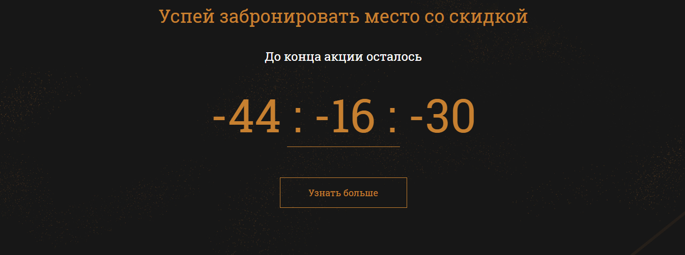

<a id="up"></a>

[К списку заданий](https://github.com/vik-vavilikhin/CompleteCourseJS) |
[Демо](https://vik-vavilikhin.github.io/CompleteCourseJS/yoga/)

---
|         Номер        |                 Наименование                          |
|:--------------------:|:------------------------------------------------------|
|[Задание 9 ](#task_09)| Создаем табы на странице                              |
|[Задание 10](#task_10)| Создаем таймер обратного отсчета на сайте             |
|[Задание 11](#task_11)| Создаем модальное окно и работаем с this              |
|[Задание 12](#task_12)| Работаем с проектом и практикуемся использовать ES6s  |
|[Задание 13](#task_13)| Реализация скрипта отправки данных из формы           |
|[Задание 14](#task_14)| Используем промисы на реальных примерах               |
|[Задание 15](#task_15)| Создаем слайдер на сайте                              |
|[Задание 16](#task_16)| Создаем калькулятор на сайте                          |


---
### **<a id="task_09"></a>Задание 9: Создаем табы на странице** _<sup>[&#9650; Наверх](#up)</sup>_
1. Скачать [проект](https://github.com/vik-vavilikhin/CompleteCourseJS/raw/master/yoga/yoga.zip), прикрепленный к уроку

2. Написать рабочие табы

3. Проверить, чтобы все работало и не было ошибок в консоли

4. Добавить папку с уроком на GitHub

**Вопросы к этому заданию**
1. Зачем применять делегирование событий?
    - Вместо того, чтобы назначать обработчик каждому элементу из множества идентичных – ставится один обработчик на их общего предка. Из него можно получить целевой элемент `event.target` и понять на каком именно потомке произошло событие, а затем обработать его.

---
### **<a id="task_10"></a>Задание 10: Создаем таймер обратного отсчета на сайте** _<sup>[&#9650; Наверх](#up)</sup>_


1. Написать таймер обратного отсчета

2. Проверить, чтобы все работало и не было ошибок в консоли

3. У таймера есть проблема (нужно исправить)
    - Если дата уже прошла, а мы заходим на страницу, то получим:
    


4. Изменить скрипт так, чтобы в таком случае выводилось: 00:00:00 
    - Необходимо подставлять 0 перед значениями, которые состоят из одной цифры (из 4:6:50 сделает 04:06:50)

3. Добавить папку с уроком на GitHub

**Вопросы к этому заданию**
1. В каких единицах мы получаем дату в JS?
    - В милисекундах, прошедших с 1 января 1970 года GMT+0

---
### **<a id="task_11"></a>Задание 11: Создаем модальное окно и работаем с this** _<sup>[&#9650; Наверх](#up)</sup>_

##### Первое задание:
1. Написать функцию вызова модального окна

2. Привязать модальное окно к кнопкам “Узнать подробнее” в табах. Код не должен дублироваться.

##### Второе задание:

У вас есть код:
```
<input id="age" value="30">

let age = document.getElementById('age');
function showUser(surname, name) {
  alert("Пользователь " + surname + " " + name + ", его возраст " + this.value);
}
showUser();
```
- Выведите на экран правильное сообщение, которое берет значение из input
- Написать скрипт в отдельном js файле.
- Проверить, чтобы все работало и не было ошибок в консоли.
- Добавить папку с уроком на GitHub

**Вопросы к этому заданию**
1. Что выведет код:
```
'use strict';

function hello() {
  console.log(this);
}

hello();
```
  - undefined

---
### **<a id="task_12"></a>Задание 12: Работаем с проектом и практикуемся использовать ES6** _<sup>[&#9650; Наверх](#up)</sup>_

1. Привести свой проект в соответствие с ES6 (в проекте Yoga, то, что можно преобразовать)

2. Используя синтаксис ES6 в отдельном документе:
    - Создать класс options
    - Он должен содержать свойства: height, width, bg, fontSize, textAlign
    - Он должен содержать метод, создающий новый div на странице, записывающий в него любой текст и при помощи cssText изменять свой стиль из переданных параметров
    - Создать новый объект через класс
    - Вызвать его метод и получить элемент на странице

3. Проверить, чтобы все работало и не было ошибок в консоли

4. Добавить папку с уроком на GitHub

**Вопросы к этому заданию**
1. Как правильно создавать новые экземпляры классов?
    - `let instanceClass = new Class();`

---
### **<a id="task_13"></a>Задание 13:** _<sup>[&#9650; Наверх](#up)</sup>_
1. Подключить скрипт отправки данных с формы к:
    - Модальному окну
    - Контактной форме

2. Проверить, чтобы все работало и не было ошибок в консоли

3. Добавить папку с уроком на GitHub

**Вопросы к этому заданию**
1. Что может отправить GET-запрос на сервер?
    - Ничего.  
    `GET`-запросы только получают данные.

---
### **<a id="task_14"></a>Задание 14: Используем промисы на реальных примерах** _<sup>[&#9650; Наверх](#up)</sup>_
1. Переписать скрипт для отправки данных с формы, используя промисы. (Из проекта Yoga)
    - Проверить, чтобы все работало и не было ошибок в консоли.
    - Добавить папку с уроком на GitHub

2. Скачать архив, прикрепленный к уроку.
    - У вас есть конвертер валют из предыдущего урока. Переписать его, используя промисы.
    - Проверить, чтобы все работало и не было ошибок в консоли.
    - Добавить папку с уроком на GitHub

**Вопросы к этому заданию**
1. Какие методы использует Promise в своей работе?
    - `.then()`   
      `.catch()`  
      `.finally()`
2. [Скачать файлы ресурсов](https://github.com/vik-vavilikhin/CompleteCourseJS/raw/master/Currency.zip)

---
### **<a id="task_15"></a>Задание 15: Создаем слайдер на сайте** _<sup>[&#9650; Наверх](#up)</sup>_
**Вопросы к этому заданию**
1. В чем преимущества применения .querySelectorAll()?
    - С помощью `querySelectorAll(selectors)` можно получить список всех элементов, указанных в качестве параметра `selectors` в виде объекта `NodeList`, который содержит все найденные элементы. К объекту `NodeList` можно применить метод `forEach()` для перебора элементов, а так же преобразовать его в массив при помощи `Array.from()`
      - `selectors` - строка, содержащая, через запятую, один или более CSS селекторов.

---
### **<a id="task_16"></a>Задание 16: Создаем калькулятор на сайте** _<sup>[&#9650; Наверх](#up)</sup>_
1. Реализовать калькулятор на сайте
    - Проверить, чтобы все работало и не было ошибок в консоли.

2. Исправить баг в логике калькулятора:
    - Если заполнить оба поля, а потом очистить одно из них - общая сумма всё равно рассчитывается.

3. Добавить папку с уроком на GitHub

**Вопросы к этому заданию**
1. Как можно преобразовать число в строку?
    - `.toString()`. Метод принимает целое число или число с плавающей запятой и преобразует его в тип `String`
      ```
      let a = 20

        a.toString();     // '20'  
        50.toString();    // '50'  
        (60).toString();  // '60'
        (7).toString(2);  // '111' (7 в двоичном представлении)
      ```
    - `String()`. Метод создает примитивный тип String для переданного ему числа.
      ```
      let a = 30;

        String(a);     // '30'  
        String(24);    // '24'  
        String(35.64); // '35.64'
      ```
    - Шаблон строки. С введением шаблонных строк в ES6 введение числа внутри `String` является допустимым способом парсинга типа данных `Integer` или `Float`
      ```
      let num = 50;  
      let flt = 50.205;  
      let string = `${num}`;      // '50'  
      let floatString = `${flt}`; // '50.205'
      ```
    - Конкатенация пустой строки.
      ```
      let a = '' + 50 // '50';
      ```
---